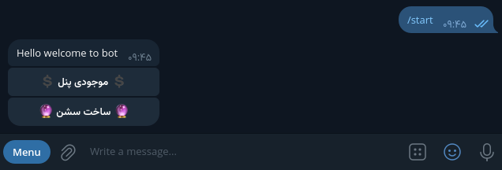
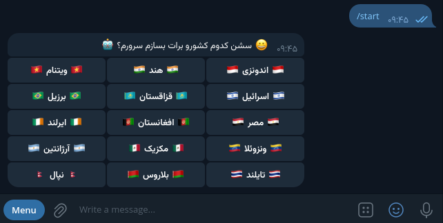

# 🤖 Telegram Session Bot 📱

## 🌟 Overview

**Telegram Session Bot** is a Telegram bot that allows you to create Telegram account sessions using virtual numbers purchased through the API of the website [onlinesim.io](https://onlinesim.io). This bot supports adding various countries for purchasing virtual numbers.

## 🚀 Features

- 📞 Purchase virtual numbers from onlinesim.io
- 💰 Get balance
- 🌍 Support for multiple countries
- 🔄 Automatic creation of Telegram account sessions
- ⚙️ Simple and user-friendly interface

## 📋 Requirements

- 🐍 Python 3.x
- 📦 Required libraries:
  - telethon
  - requests

⚠️ **Note:** This source code is outdated, and the code may be a bit messy. I apologize for any issues or non-functionality!
